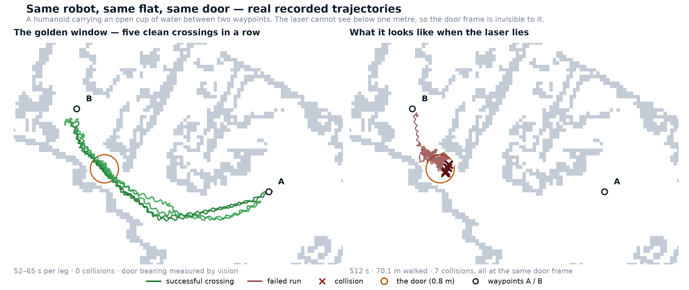
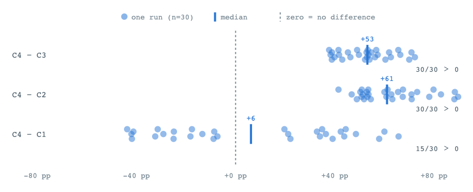
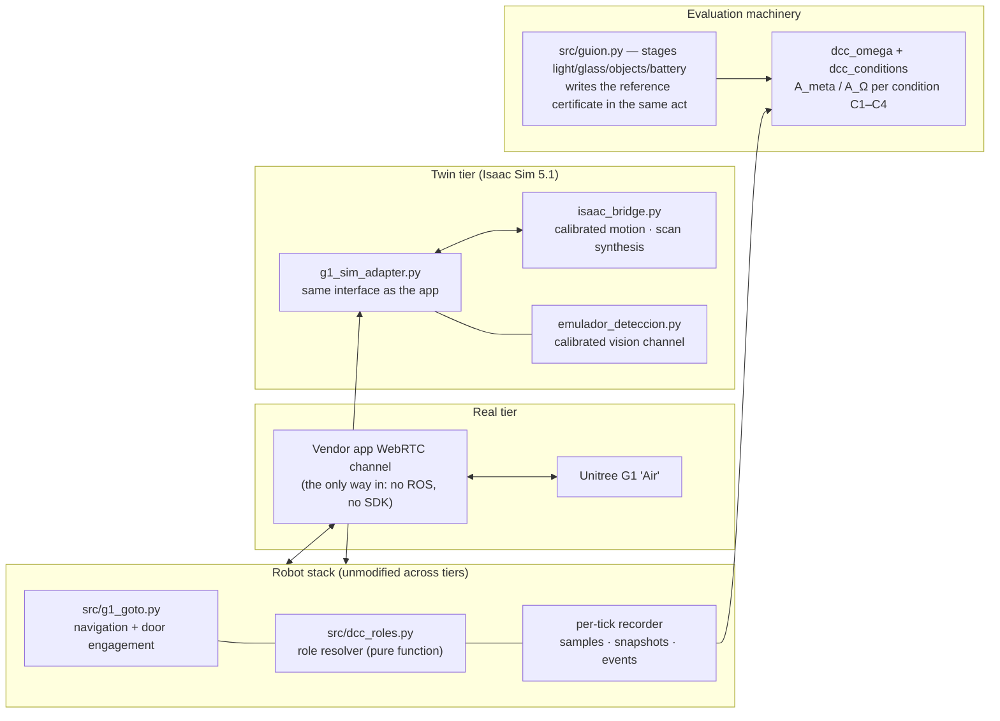
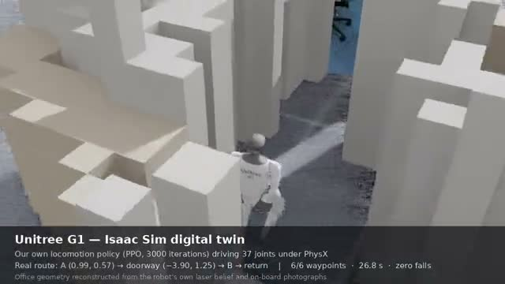
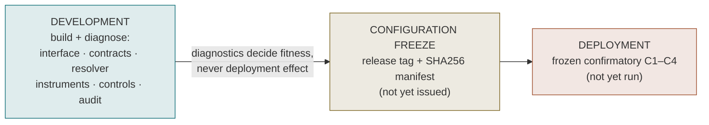
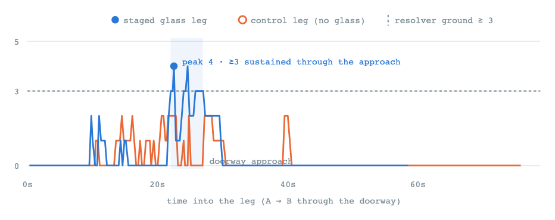

<div align="center">

# Computational Cognitive Memory<br/>Robotic Evaluation

**Results and reproducibility package for Experiment 2 of<br/>
*A Computational Theory of Cognitive Memory***

Qiu · Pham · Lendinez Ibanez · Li — University of Bedfordshire · University of
Birmingham · Telefónica S.A. (draft V5.8, 2026-08)

A robotic development-to-deployment evaluation on a **stock Unitree G1 humanoid**
and its calibrated **Isaac Sim digital twin**.<br/>
<sub>(Experiment 1, the LLM evaluation, lives in
[Computational-cognitive-memory-llm-evaluation](https://github.com/5G-ERA/Computational-cognitive-memory-llm-evaluation).)</sub>

[](https://github.com/5G-ERA/Computational-cognitive-memory-robotic-evaluation/actions/workflows/verify.yml)
[](#citing)
[](REPRODUCIBILITY.md)
[](#the-evaluation-lifecycle)
[](requirements.txt)
[](sim/)
[](#the-platform)

[**Results**](#results-at-a-glance) · [**Reproduce**](#reproduce-the-numbers) ·
[**Platform**](#the-platform) · [**Lifecycle**](#the-evaluation-lifecycle) ·
[**Repository map**](#repository-map) · [**REPRODUCIBILITY.md**](REPRODUCIBILITY.md)

<br/>



<sub>Real recorded data, no retouching. **Left:** five consecutive clean crossings.
**Right:** the same robot, the same door, 512 s and 70 m walked, seven collisions
against a frame its laser could not see. The gap between these two panels is what
this evaluation measures.</sub>

</div>

---

A consumer humanoid — no ROS on board, no SDK, a LiDAR that goes blind below one
metre — carries an open cup through a narrow door while reasoning about **how much
to trust its own senses**. Above navigation sits a cognitive-memory layer that
resolves, at every decision boundary, *which role governs*: keep trusting the
incumbent sense, switch to an alternative, escalate to review, or withhold.

## Results at a glance

Four conditions cross **interface** (original I⁰ vs revised I¹) × **resolution**
(temporal incumbent vs distributed/DCC), per paper §8.6:

<div align="center">

| | Original interface | Revised (DCA) interface |
|:---|:---:|:---:|
| **Temporal incumbent** | C1 — A_meta 65% | C3 — A_meta 13% |
| **Distributed / DCC** | C2 — A_meta 0% | **C4 — A_meta 63%** |

</div>

Conditions: **C1** = original interface + temporal incumbent · **C2** = original +
distributed · **C3** = revised + temporal · **C4** = revised + distributed/DCC.
Unit of analysis: the run; contrasts are paired within-run differences over the
30 campaign runs. Paper §8.7 names:

<div align="center">

| Contrast | Effect of | Median [IQR] | Runs won | Status |
|:---|:---|:---:|:---:|:---|
| **C4 − C3** | resolution, under revised interface | **+53.1 pp** [+43, +60] | **30 / 30** | ✅ UNANIMOUS — development tier |
| **C4 − C2** | interface, under distributed resolution | **+61.1 pp** [+52, +71] | **30 / 30** | ✅ UNANIMOUS — development tier |
| C3 − C1 | interface, under temporal incumbent | −52.5 pp [−74, −14] | 0 / 30 | ◼ NEGATIVE — one axis alone hurts |
| C2 − C1 | resolution, under original interface | −58.9 pp [−86, −22] | 0 / 30 | ◼ NEGATIVE — one axis alone hurts |
| C4 − C1 | full system vs plain baseline | +6.2 pp [−25, +39] | 15 / 30 | ⬜ FLAT on time average — decided at transitions |



</div>

> **Each axis alone makes things worse; together they win unanimously** — the
> revised interface and distributed resolution are *complements, not substitutes*.
> Where the time-averaged C4−C1 diagonal is flat, the difference lives at
> transitions: C4 adopts **34/40** demanded switches at 0.6 s median delay; the
> temporal incumbent misses 68% of them.

Full tables: [`tasks/RESULTADOS_ISAAC_V2.md`](tasks/RESULTADOS_ISAAC_V2.md) ·
machine-readable:
[`reproducibility/resultados_stage2_dev.json`](reproducibility/resultados_stage2_dev.json)

> [!NOTE]
> **Tier disclaimer.** Everything here is the **development stage** of the paper's
> Note 8 lifecycle: instruments built, diagnosed and exercised in the twin plus
> logged real sessions. The frozen confirmatory C1–C4 deployment evaluation has
> **not** been run.

## The platform

Two execution tiers drive the **same unmodified robot stack**:



The twin is calibrated channel by channel against **132 real runs** — motion
(VSCALE · TAU · interface latency · wall-clock pace), the app's LiDAR filter, the
WebRTC-throttled vision channel, per-label detection curves — every constant with
its derivation in [`REPRODUCIBILITY.md`](REPRODUCIBILITY.md) §5.

<div align="center">



<sub>The twin also walks: our own locomotion policy (PPO, 3,000 iterations, one
RTX 3090) drives all 37 joints under PhysX through the office reconstructed from
the robot's own laser and photographs — 6/6 waypoints, 26.8 s, zero falls.</sub>

</div>

## The evaluation lifecycle



Development diagnostics are kept strictly apart from deployment-effect evidence —
the paper cites this repository's own example: a **solid-wall control invalidated
the first glass witness** by localising an instrumentation failure (successful
diagnostic, witness excluded, instrument redesigned and re-validated):

<div align="center">



<sub>The redesigned coverage instrument, live: with glass staged (blue) it sustains
the resolver's ground through the doorway approach; the control leg (orange) never
crosses it. Exclusions are logged, never silent:
[`reproducibility/EXCLUSIONES.md`](reproducibility/EXCLUSIONES.md).</sub>

</div>

## Reproduce the numbers

Scoring is **offline and deterministic** — recorded runs plus their certificates,
no robot needed:

```bash
git clone https://github.com/5G-ERA/Computational-cognitive-memory-robotic-evaluation.git
cd Computational-cognitive-memory-robotic-evaluation
pip install -r requirements.txt          # frozen env: reproducibility/requirements-frozen.txt

sh reproducibility/verifica.sh           # integrity: 213-entry SHA256 manifest, relative paths
python3 analysis/test_dcc_omega.py       # 5 negative controls of the scoring machinery
G1_DCC_MAN=$PWD/tasks/manifiestos/campana_dcc_v2.txt python3 analysis/nivel_run.py
G1_DCC_MAN=$PWD/tasks/manifiestos/campana_dcc_v2.txt python3 analysis/corre_secundarios.py
python3 reproducibility/exporta_resultados.py   # machine-readable json + csv
```

Expected output (abridged):

```text
PAQUETE INTEGRO: todas las sumas verifican.
TODOS LOS CONTROLES PASAN
  C4-C3  +53 pp  [+43, +60]   C4>C3 en 30/30 runs, C4<C3 en 0
  C4-C2  +61 pp  [+52, +71]   C4>C2 en 30/30 runs, C4<C2 en 0
escrito reproducibility/resultados_stage2_dev.json (30 runs) y resultados_stage2_dev.csv
```

The [`verify` workflow](.github/workflows/verify.yml) runs this same check on
every push.

<details>
<summary><b>Re-running the campaigns</b> (needs the twin: lab GPU + Isaac bridge)</summary>

<br/>

```bash
python3 src/campana_dcc_v2.py            # full campaign, resumable, appends to the v2 manifest
python3 src/guion.py T8 --destino B      # one staged scenario (zone-triggered glass + light)
python3 src/guion.py T3 --seco           # dry run: print a schedule without the robot
```

Twin runs reproduce *statistically*, not bit-identically (declared: the sensor
noise draw is unseeded); the recorded dataset is the frozen evidence. Real-robot
sessions run from
[`tasks/SESSION_PREP_GATE_AB.md`](tasks/SESSION_PREP_GATE_AB.md).

</details>

## Repository map

| Path | Contents |
|:---|:---|
| [`REPRODUCIBILITY.md`](REPRODUCIBILITY.md) | **Start here** — the paper's §8.16 package checklist, mapped item by item |
| [`src/`](src/) | The robot stack and evaluation runtime — navigation, staging, certificates, C1–C4 conditions, role resolver |
| [`analysis/`](analysis/) | Scorers, negative controls, variance and realism batteries |
| [`dataset/`](dataset/) | Every run: per-tick samples, laser snapshots, camera frames, reference certificates |
| [`reproducibility/`](reproducibility/) | Frozen environment, SHA256 manifest + verifier, exclusion log, machine-readable results |
| [`tasks/`](tasks/) | Results, decision ledger, session runbooks, campaign manifests |
| [`sim/`](sim/) | Isaac bridge, scene generator, calibrated vision emulator |
| [`docs/`](docs/) | Protocols, figures, platform notes |

<details>
<summary>All directories</summary>

<br/>

| Path | Contents |
|:---|:---|
| `meta-reasoner-2.0/` | The configuration-first DCE runtime (governance layer) |
| `summit/` · `calib/` · `calib_luz/` · `weights/` | Reference map, camera calibration, staged light tandas, model weights |
| `config/` · `state/` · `data/` | Runtime configuration and state |
| `crashes/` · `logs/` | Collision evidence with pre-impact frames; session logs |
| `archive/` · `attic/` | Historical material — kept for the audit trail, out of the way |

**Branches:** `ensayo/door-gate-isaac` — the evaluation (active) ·
`baseline` — frozen no-governance navigation for fair comparison · `main` —
kept in sync with the evaluation branch.

</details>

## Citing

> Qiu, R., Pham, D., Lendinez Ibanez, A., Li, D.
> *A Computational Theory of Cognitive Memory.* V5.8, under review.
> Experiment 2 — robotic development-to-deployment evaluation:
> this repository, Supplementary Note 8.

<div align="center">

<sub>University of Bedfordshire · University of Birmingham · Telefónica S.A. —
within the [5G-ERA](https://github.com/5G-ERA) project.<br/>
Platform layer: a stock G1 driven through the vendor app's single WebRTC channel —
reverse-engineered against the owner's own robot for interoperability;
no proprietary assets are redistributed.</sub>

</div>
