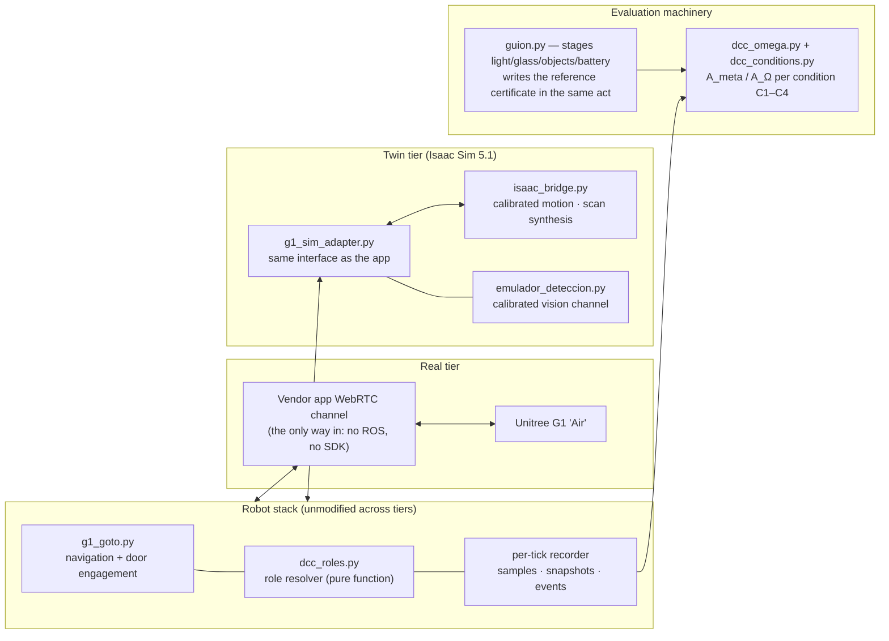
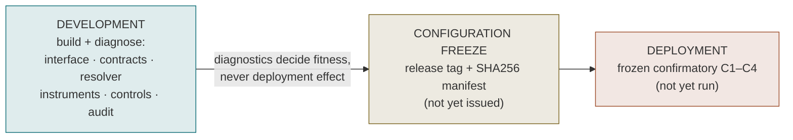

# Computational Cognitive Memory — Robotic Evaluation

**The robotic development-to-deployment evaluation (Experiment 2) of
[*A Computational Theory of Cognitive Memory*](#citing) — on a stock Unitree G1
humanoid and its calibrated Isaac Sim digital twin.**

A consumer humanoid — no ROS on board, no SDK, a LiDAR that goes blind below one
metre — carries an open cup through a narrow door while reasoning about **how much
to trust its own senses**. Above navigation sits a cognitive-memory layer that
resolves, at every decision boundary, *which role governs*: keep trusting the
incumbent sense, switch to an alternative, escalate to review, or withhold.


<sub>Real recorded data, no retouching. **Left:** five consecutive clean crossings.
**Right:** the same robot, the same door, 512 s and 70 m walked, seven collisions
against a frame its laser could not see. The gap between these two panels is what
this evaluation measures.</sub>

---

## Results at a glance (development tier)

Four conditions cross **interface** (original I⁰ vs revised I¹) × **resolution**
(temporal incumbent vs distributed/DCC), per paper §8.6:

| | Original interface | Revised (DCA) interface |
|---|---|---|
| **Temporal incumbent** | C1 — A_meta 65% | C3 — A_meta 13% |
| **Distributed / DCC** | C2 — A_meta 0% | **C4 — A_meta 63%** |

Paired within-run contrasts over 30 campaign runs (paper §8.7 names):

| Contrast | Effect of | Median [IQR] | Runs won |
|---|---|---|---|
| **C4 − C3** | resolution, under revised interface | **+53.1 pp** [+43, +60] | **30/30** |
| **C4 − C2** | interface, under distributed resolution | **+61.1 pp** [+52, +71] | **30/30** |
| C3 − C1 | interface, under temporal incumbent | −52.5 pp | 0/30 |
| C2 − C1 | resolution, under original interface | −58.9 pp | 0/30 |


**Each axis alone makes things worse; together they win unanimously** — the
revised interface and distributed resolution are *complements, not substitutes*.
Where the time-averaged C4−C1 diagonal is flat, the difference lives at
transitions: C4 adopts **34/40** demanded switches at 0.6 s median delay; the
temporal incumbent misses 68% of them. Full tables:
[`tasks/RESULTADOS_ISAAC_V2.md`](tasks/RESULTADOS_ISAAC_V2.md) · machine-readable:
[`reproducibility/resultados_stage2_dev.json`](reproducibility/resultados_stage2_dev.json).

> **Tier disclaimer.** Everything here is the **development stage** of the paper's
> Note 8 lifecycle: instruments built, diagnosed and exercised in the twin plus
> logged real sessions. The frozen confirmatory C1–C4 deployment evaluation has
> **not** been run.

---

## The platform

Two execution tiers drive the **same unmodified robot stack**:



The twin is calibrated channel by channel against **132 real runs** (motion
VSCALE/TAU/latency/pace, the app's LiDAR filter, the WebRTC-throttled vision
channel, per-label detection curves) — every constant with its derivation in
[`REPRODUCIBILITY.md`](REPRODUCIBILITY.md) §5.


<sub>The twin also walks: our own locomotion policy (PPO, 3,000 iterations, one
RTX 3090) drives all 37 joints under PhysX through the office reconstructed from
the robot's own laser and photographs — 6/6 waypoints, zero falls.</sub>

## The evaluation lifecycle (paper Note 8)



Development diagnostics are kept strictly apart from deployment-effect evidence —
the paper cites this repo's own example: a **solid-wall control invalidated the
first glass witness** by localising an instrumentation failure (successful
diagnostic, witness excluded, instrument redesigned and re-validated):


<sub>The redesigned coverage instrument, live: with glass staged (blue) it sustains
the resolver's ground through the doorway approach; the control leg (orange) never
crosses it. Exclusions are logged, never silent:
[`reproducibility/EXCLUSIONES.md`](reproducibility/EXCLUSIONES.md).</sub>

---

## Reproduce the numbers (no robot needed)

Scoring is offline and deterministic — recorded runs + their certificates:

```bash
git clone https://github.com/5G-ERA/Computational-cognitive-memory-robotic-evaluation.git
cd Computational-cognitive-memory-robotic-evaluation
git checkout ensayo/door-gate-isaac
pip install -r requirements.txt          # frozen env: reproducibility/requirements-frozen.txt

sh reproducibility/verifica.sh           # integrity: 213-entry SHA256 manifest, relative paths
python3 analysis/test_dcc_omega.py       # 5 negative controls of the scoring machinery
G1_DCC_MAN=$PWD/tasks/manifiestos/campana_dcc_v2.txt python3 analysis/nivel_run.py
G1_DCC_MAN=$PWD/tasks/manifiestos/campana_dcc_v2.txt python3 analysis/corre_secundarios.py
python3 reproducibility/exporta_resultados.py   # machine-readable json + csv
```

Re-running the **campaigns** needs the twin (lab GPU + Isaac bridge):
`python3 campana_dcc_v2.py` (resumable). Staged single scenarios:
`python3 guion.py T8 --destino B`. Real-robot sessions run from
[`tasks/SESSION_PREP_GATE_AB.md`](tasks/SESSION_PREP_GATE_AB.md).

## Repository map

| Path | What |
|---|---|
| [`REPRODUCIBILITY.md`](REPRODUCIBILITY.md) | **Start here** — paper §8.16 checklist mapped item by item |
| `dcc_omega.py` · `dcc_conditions.py` · `dcc_roles.py` · `dcc_secundarios.py` | Certificates, C1–C4 conditions, role resolver, secondary outcomes |
| `g1_goto.py` · `guion.py` · `g1_sim_adapter.py` | Navigation stack, staging channel, twin adapter |
| `sim/` | Isaac bridge, scene generator, calibrated vision emulator |
| `analysis/` | Scorers, negative controls, variance, realism battery |
| `dataset/` | Every run: per-tick samples, snapshots, frames, certificates |
| `tasks/` | Results, decision ledger (D1–D10), session runbooks, manifests |
| `reproducibility/` | Frozen env, SHA256 manifest + verifier, exclusion log, machine-readable results |
| `summit/` · `calib/` · `weights/` | Reference map, camera calibration, model weights |
| `meta-reasoner-2.0/` | The configuration-first DCE runtime (governance layer) |
| `archive/` · `attic/` · `logs/` | Historical material — kept, out of the way |

**Branches:** `ensayo/door-gate-isaac` — the evaluation (this branch) ·
`baseline` — frozen no-governance navigation for fair comparison · `main` —
platform layer.

## Decisions and honesty

Ten decisions that belong to the supervising author are parked in
[`tasks/DECISIONES_PENDIENTES_RENXI.md`](tasks/DECISIONES_PENDIENTES_RENXI.md),
each with evidence and a reversible default — including **D10**, a safety finding:
thin close obstacles evaporate from the robot's belief exactly where the door
controller commits (shared pipeline with the real robot). Negative results and
instrument failures are reported, not buried: the claim-boundary chain of paper
§8.15 (behaviour ⇏ conformity ⇏ recovery ⇏ continuity ⇏ benefit) is kept
throughout.

## Citing

> Qiu, R., Pham, D., Lendinez Ibanez, A., Li, D. *A Computational Theory of
> Cognitive Memory.* (V5.8, under review). Experiment 2 — robotic
> development-to-deployment evaluation: this repository,
> Supplementary Note 8.

The platform layer (driving a stock G1 through the vendor app's single WebRTC
channel) is documented on `main` and in `docs/`. Reverse-engineered against the
owner's own robot for interoperability; no proprietary assets are redistributed.
