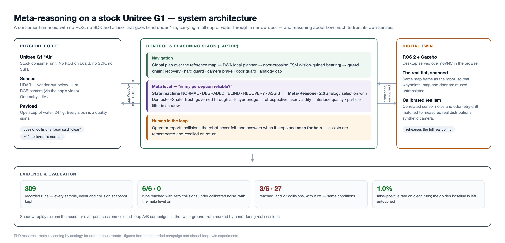

# Meta-Reasoning on a Stock Unitree G1

> A consumer humanoid — no ROS on board, no SDK, and a LiDAR that goes blind below one metre —
> carrying an open cup of water through a narrow door, while reasoning about **how much to trust
> its own senses**.


<sub>Real recorded data, no retouching. **Left:** the golden window — five consecutive clean
crossings. **Right:** the same robot, the same door, 512 s and 70 m walked, seven collisions
against a frame its laser could not see. The gap between those two panels is what this research
is about.</sub>

PhD research (University of Bedfordshire) on **meta-reasoning by analogy** for autonomous robots.
The robot is a stock Unitree G1 “Air”: the only way in is the vendor app, so the whole stack is
built on top of that single channel. Above navigation sits a meta level that decides *which sense
to believe*, recovers when it gets stuck, and asks a human for help when it cannot.

> **Picking this up? Go to [`tasks/`](tasks/)** — it says what happens next and what to take to
> the lab.

---

## Why this is interesting

The G1's laser is cut below ~1 m by design. Measured over 193 real collisions: **55 % happened
while the laser was reporting clear ground**. A robot that trusts its sensors blindly walks into
the same door frame forever — so the real problem is not navigation, it is **self-assessment**:
knowing when your perception is lying, and what to do about it.

| | Meta level ON | OFF |
|---|---|---|
| Runs reached (under calibrated sensor noise) | **6 / 6** | 3 / 6 |
| Collisions in those runs | **0** | 27 |
| False interventions on clean runs | 1.0 % | — |
| Time cost | +8.6 % | — |

Closed-loop A/B in the digital twin, interleaved arms. Full problem → solution → evidence map:
[`docs/img/problem_solution_evidence.png`](docs/img/problem_solution_evidence.png).

---

## How it works, in one minute



**Control path.** The robot exposes nothing but its own iOS app. A Python stack on the laptop
attaches to the app's WebView over USB (Chrome DevTools Protocol), reads the live LiDAR cloud and
camera frames, and drives the robot by injecting joystick commands ~10 times a second.

**Navigation.** Global plan over a reference map → DWA local planner → a door-crossing state
machine that steers on a *vision-measured* door bearing → an ordered guard chain that can only
ever remove speed.

**Meta level.** Renxi Qiu's Meta-Reasoner 2.0 selects navigation analogies with Dempster–Shafer
trust; a four-layer bridge feeds it evidence and applies its verdict. Above that runs an explicit
state machine — `NORMAL · DEGRADED · BLIND · RECOVERY · ASSIST` — driven by retrospective laser
validity, door-centre contradictions and interface quality. Out of options, the robot stops and
asks the operator for help, remembers the rescue, and recalls it when it passes there again.

**Digital twin.** The same code, unmodified, runs against a Gazebo world built from a laser scan
of the real flat, in the same map frame — so real waypoints, map and door are reused untranslated.
Sensor noise is calibrated against real distributions, so the twin fails the way reality does.

---

## Repository layout

| Path | What lives there |
|---|---|
| `g1_goto.py` | The robot brain: navigation, door FSM, guard chain, meta level, run recording |
| `g1_meta2_bridge.py`, `meta-reasoner-2.0/` | Meta-reasoning layer (the reasoner itself is **never modified**; its 11 tests must stay green) |
| `g1_nav_v2.py`, `g1_metrics.py`, `g1_perception.py`, `g1_particle_filter.py` | Navigation primitives, sensing self-assessment, vision client, shadow estimator |
| `g1_sim_adapter.py`, `sim/` | Digital twin: adapter, Docker recipe, worlds, launch files — see the [twin guide](sim/RUN_AND_REBUILD.md) |
| `perception_server.py` | Off-board vision service (metric depth + object detection) |
| `spill_mark.py` | Ground-truth marker the operator uses during real sessions |
| `analysis/` | Per-run analysis, autopsy reports, and shadow replay of the meta level over past runs |
| `campaigns/` | Automated experiment campaigns in the twin |
| `dataset/`, `data/` | Every run ever recorded (samples, events, collision snapshots), and the maps and waypoints the robot navigates with |
| `config/`, `state/`, `results/` | Reasoner configurations, per-experiment trust state, campaign results |
| **`tasks/`** | **What to do next — start here if you are picking the project up** |
| `docs/` | Protocols, plans and reports — start with the runbook below |
| `logs/`, `tools/`, `attic/` | Historical campaign logs, utilities (plots, figures, calibration) and old probes kept for provenance |

---

## Getting started

**If you are new, read in this order:**

1. [`docs/G1_Test_Protocol_Operator_Runbook.pdf`](docs/G1_Test_Protocol_Operator_Runbook.pdf) —
   the operating manual: every command, for the twin and for the real robot.
2. [`sim/RUN_AND_REBUILD.md`](sim/RUN_AND_REBUILD.md) — launch, rebuild and back up the
   digital twin. Everything here runs without touching the robot.
3. [`docs/G1_Disciplined_Session_Protocol.pdf`](docs/G1_Disciplined_Session_Protocol.pdf) — the
   method. Not optional: one undisciplined session once destroyed a week of results.
4. [`docs/G1_Branch_Strategy_and_New_Stack_Case.pdf`](docs/G1_Branch_Strategy_and_New_Stack_Case.pdf) —
   which code to run for which experiment, and what the newest work buys you.

> Configurations and trust state live in `config/` and `state/`, but every documented command
> still passes a bare filename — the loader resolves it. Nothing in the protocols had to change.

**Fastest useful thing you can do** — replay the meta level over a recorded session, with no robot
and no simulator:

```bash
python3 analysis/replay_msm.py dataset/<run>.json
```

---

## Branches

| Ref | Purpose |
|---|---|
| `golden-doorvis` *(tag)* | Frozen baseline: the session with five clean runs in a row. **Every re-baseline measurement uses this.** |
| `main` | Mainline development |
| `tutor-feedback-metareasoner-sim` | Newest work: meta state machine, human channel, calibrated twin noise, synthetic camera |

Rule of thumb: **golden = measure · main = the plan · the `-sim` branch = the new work.** Nothing
new goes on the robot before a fresh baseline exists to compare it against.

---

## Ground rules

Learned the expensive way, enforced every session:

- **One change per batch**, validated in the twin with the new path actually exercised.
- **No code edits during a real session.** None.
- Defaults reproduce previous behaviour exactly — every new behaviour sits behind a flag.
- Instrumentation down = run invalid, repeat it.
- Noise-lane results are their own baseline; never compared against clean or real timings.

**Safety when driving the real robot:** keep the physical remote in hand as a kill switch
(L2 + B = damping/stop), clear 2–3 m around the robot, and start freshly charged and standing in
walk mode.

---

## Status

The meta-reasoning stack is **validated in the digital twin**: closed-loop A/B under calibrated
noise, plus a shadow replay over 309 recorded real runs. Its **real-robot trial follows the next
re-baseline session and its decision gate.** Results, caveats and open items are tracked in the
documents above.

## Disclaimer

Research and interoperability work on the author's own hardware. Not affiliated with Unitree.
Moving a 35 kg humanoid programmatically carries real risk — reproduce at your own risk, with the
kill switch in hand.
